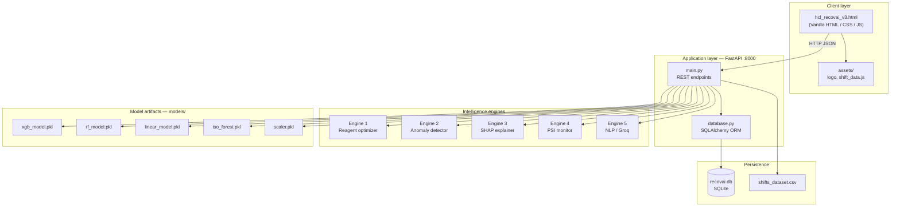
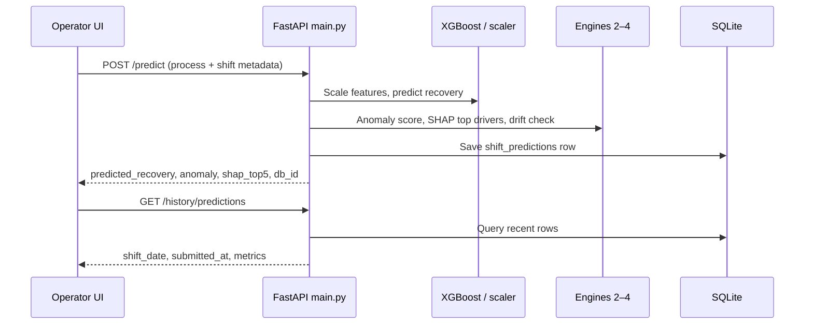

# RecovAI

**AI-powered decision support for copper flotation operations**

Hindustan Copper Limited · Malanjkhand Copper Project

RecovAI is a full-stack application that helps plant operators and metallurgists predict copper recovery, tune reagent dosing, detect unusual shifts, monitor model drift, and review shift performance. It combines machine learning models with explainability tools and an optional natural-language assistant backed by Groq (Llama 3).

---

## Table of Contents

- [Overview](#overview)
- [Screenshots](#screenshots)
- [System Architecture](#system-architecture)
- [Request Flow](#request-flow)
- [AI Engines](#ai-engines)
- [Models and Data](#models-and-data)
- [Technology Stack](#technology-stack)
- [Project Structure](#project-structure)
- [Setup](#setup)
- [Running the Application](#running-the-application)
- [API Reference](#api-reference)
- [Database](#database)
- [Team](#team)
- [Acknowledgements](#acknowledgements)

---

## Overview

Copper flotation recovery depends on many interacting variables: head grade, feed rate, pH, pulp density, reagent doses, and more. Manual tracking is slow and often reactive. RecovAI supports day-to-day decisions by:

- Predicting **recovery (%)** for a shift before or after it runs
- Recommending **reagent doses** (SIPX, frother, lime, depressant) toward a target recovery
- Flagging **anomalous shifts** with Isolation Forest scoring
- Explaining **why** a prediction looks high or low (SHAP)
- Watching for **data drift** with Population Stability Index (PSI)
- Generating **shift summaries** and answering plant questions via Groq when configured

The web UI is a single-page application (`hcl_recovai_v3.html`). The API layer is FastAPI; persistence uses SQLite through SQLAlchemy.

---

## Screenshots

### Dashboard


### Recovery prediction


### SHAP explainability


### Anomaly detection


### Shift report


### PSI drift monitor


---

## System Architecture



---

## Request Flow

Typical path when an operator submits shift data from the UI:



For chat and AI shift narratives, the UI calls `POST /report` with either a `message` (chat) or `shift` + `use_ai` (report). Engine 5 uses the Groq API when `GROQ_API_KEY` is set in `.env`.

---

## AI Engines

| Engine | Module | Role |
|--------|--------|------|
| 1 | `engine1_reagent.py` | SciPy-based reagent dose optimization (SIPX, frother, lime, depressant) |
| 2 | `engine2_anomaly.py` | Isolation Forest anomaly scoring on shift feature vectors |
| 3 | `engine3_shap.py` | SHAP TreeExplainer for per-prediction and global importance |
| 4 | `engine4_psi.py` | PSI drift monitoring vs training distribution |
| 5 | `engine5_nlp.py` | Groq (Llama 3) shift reports and plant Q&A; rule-based fallback |

### Engine 1 — Reagent optimization

Uses numerical optimization (e.g. L-BFGS-B / differential evolution) to search reagent doses that move predicted recovery toward a target while penalizing excessive chemical use.

### Engine 2 — Anomaly detection

An **Isolation Forest** trained on historical shifts assigns an anomaly score to each submission. Severity bands (example):

| Score (typical) | Severity | Suggested action |
|-----------------|----------|------------------|
| Above warning threshold | Normal | Continue standard monitoring |
| Between warning and alert | Warning | Review recent process changes |
| Below alert threshold | Critical | Investigate before next shift |

### Engine 3 — SHAP explainability

**SHAP** values show which inputs pushed recovery up or down for a given prediction. The API returns a compact top-five list for the UI; training scripts can emit full waterfall/beeswarm plots under `recovai_output/`.

### Engine 4 — PSI drift

**Population Stability Index** compares live feature distributions to the training baseline:

| PSI | Interpretation | Action |
|-----|----------------|--------|
| &lt; 0.10 | Stable | Safe to use current models |
| 0.10 – 0.25 | Moderate drift | Monitor; plan validation |
| &gt; 0.25 | Strong drift | Consider retraining or recalibration |

### Engine 5 — NLP (Groq)

When `GROQ_API_KEY` is present in `.env`, Engine 5 calls **Groq** (`llama-3.1-8b-instant` by default) for shift narratives and chat. If the key is missing or the call fails, the backend returns a structured rule-based response so the UI remains usable.

---

## Models and Data

### Training summary

| Item | Detail |
|------|--------|
| Shifts | 1,778 (Malanjkhand plant data) |
| Train / test | ~80% / ~20% temporal split |
| Train window | Oct 2024 – Dec 2025 |
| Test window | Jan 2026 – May 2026 |
| Target | `Recovery (%)` |
| Features | 26 process variables (plus engineered lags/rolls where used) |

### Model comparison (recovery prediction)

| Model | R² | RMSE | MAE | Meets target (R² &gt; 0.85) |
|-------|-----|------|-----|---------------------------|
| **XGBoost** (primary) | **0.972** | 0.139 | 0.104 | Yes |
| Random Forest | 0.910 | 0.248 | 0.197 | Yes |
| Linear baseline | — | — | — | Reference only |

Target thresholds used in project documentation: R² &gt; 0.85, RMSE &lt; 0.50, MAE &lt; 0.50.

### Top XGBoost drivers (global importance)

| Feature | Importance |
|---------|------------|
| Feed_Condition_Num | 0.598 |
| Prev_Recovery (%) | 0.105 |
| Conc. Mass Pull (%) | 0.057 |
| Tails Grade (%Cu) | 0.050 |
| Roll7_Recovery (%) | 0.046 |

Columns excluded from training to avoid leakage include concentrate/tailings mass flows derived from the same shift outcome (e.g. `COPPER IN CONCENTRATE (MT)`, `COPPER IN TAILINGS (MT)`).

### Key process inputs (runtime / predict)

Head grade, feed rate, flotation pH, pulp density, air flow, SIPX, frother, lime, depressant, particle size, water recovery, rougher concentrate grade — aligned with `POST /predict` in `main.py`.

---

## Technology Stack

| Layer | Technologies |
|-------|----------------|
| API | FastAPI, Uvicorn, Pydantic v2 |
| ML | XGBoost, scikit-learn (RF, Isolation Forest, scalers) |
| Explainability | SHAP |
| Optimization | SciPy |
| LLM | Groq API (Llama 3 family) |
| Data | Pandas, NumPy |
| Database | SQLite, SQLAlchemy 2.x |
| Frontend | HTML, CSS, JavaScript, Chart.js |
| Config | python-dotenv (`.env`) |
| Export | openpyxl (Excel shift reports) |

---

## Project Structure

```
HCL-MCP-AI-project-/
├── main.py                 # FastAPI application (v2.0)
├── database.py             # ORM models, migrations, CRUD
├── hcl_recovai_v3.html     # Main UI
├── shifts_dataset.csv      # Shift data for dashboard / anomalies
├── requirements.txt
│
├── engines/
│   ├── engine1_reagent.py
│   ├── engine2_anomaly.py
│   ├── engine3_shap.py
│   ├── engine4_psi.py
│   └── engine5_nlp.py
│
├── models/                 # Serialized models (gitignored *.pkl in some setups)
├── data/processed/         # Training CSVs
├── recovai_output/         # Training plots and extra artifacts
├── outputs/                # Comparison charts, training_report.txt
├── assets/                 # Static UI assets
│
├── train_all.py            # Train and export models
├── recovai_train.py
├── recov_train_rf.py
└── recov_train_linear.py
```

Runtime files (not committed): `.env`, `recovai.db`, `venv/`, `contacts.json`, `feedback.json`.

---

## Setup

### Prerequisites

- Python 3.10 or newer
- pip
- Groq API key for live AI chat and reports — [console.groq.com](https://console.groq.com)

### Installation

```bash
git clone https://github.com/dikshadamahe/HCL-MCP-AI-project-.git
cd HCL-MCP-AI-project-

python -m venv venv

# Windows
venv\Scripts\activate

# macOS / Linux
source venv/bin/activate

pip install -r requirements.txt
```

Create `.env` in the project root (never commit this file):

```env
GROQ_API_KEY=gsk-your-key-here
```

Optional: override the database URL (default is local SQLite):

```env
DATABASE_URL=sqlite:///./recovai.db
```

Train models if `models/*.pkl` are not already present:

```bash
python train_all.py
```

---

## Running the Application

**Terminal 1 — backend**

```bash
uvicorn main:app --reload --host 127.0.0.1 --port 8000
```

| Check | URL |
|-------|-----|
| Health | http://localhost:8000/health |
| Readiness | http://localhost:8000/api/test |
| Swagger UI | http://localhost:8000/docs |

**Terminal 2 — frontend (recommended)**

```bash
python -m http.server 5500
```

Open http://localhost:5500/hcl_recovai_v3.html

The UI expects the API at `http://localhost:8000`. CORS is enabled on the backend for local development.

---

## API Reference

| Method | Endpoint | Description |
|--------|----------|-------------|
| GET | `/health` | Service health and model load count |
| GET | `/api/test` | Detailed readiness checklist |
| POST | `/predict` | Predict recovery; persists submission |
| POST | `/optimize` | Reagent dose recommendations |
| GET | `/api/anomalies` | Recent shifts with anomaly scores |
| GET | `/api/importance` | Global feature importance |
| GET | `/api/heatmap` | Feature correlation matrix |
| GET | `/api/pdp` | Partial dependence curve data |
| GET | `/api/dashboard` | Filtered dashboard aggregates |
| POST | `/report` | Shift report or chat (`message` / `shift`) |
| GET | `/api/report/download` | Excel shift report |
| POST | `/api/forecast` | Multi-day recovery forecast |
| GET | `/history/predictions` | Submission history |
| GET | `/history/predictions/{id}` | Single submission detail |
| POST | `/api/contact` | Contact form |
| POST | `/api/feedback` | User feedback |

Interactive documentation: http://localhost:8000/docs

---

## Database

SQLite database file: `recovai.db` (created on first backend start).

| Table | Purpose |
|-------|---------|
| `shift_predictions` | Each `/predict` call: inputs, prediction, anomaly/drift summary, optional `shift_date`, `shift`, `operator_name`, `notes` |
| `shift_reports` | NLP shift reports linked to predictions |

History in the UI uses `GET /history/predictions`, which returns both **shift date** (operator-entered) and **submitted at** (server timestamp).

---

## Team

**VIT Bhopal University** · Intern project with **Hindustan Copper Limited (HCL)**  
**Project:** Malanjkhand Copper Project — flotation plant optimization

| Name | Role |
|------|------|
| Diksha Damahe | Frontend UI, FastAPI backend, ML model training, and full-stack integration |
| Bhavya Jaiprakash Khatri | Project documentation, technical report, and submission materials |
| Hiya Porwal | Dataset preparation — cleaning, transformation, and supporting data work for training and dashboards |
| Ritica Awasthi | Database layer — SQLite integration |

---

## Acknowledgements

We thank Hindustan Copper Limited for the opportunity to work on this project as interns. Their domain guidance and support were essential to building a system grounded in real plant operations.

---

*RecovAI — internal decision-support prototype for educational and demonstration purposes at HCL Malanjkhand.*
